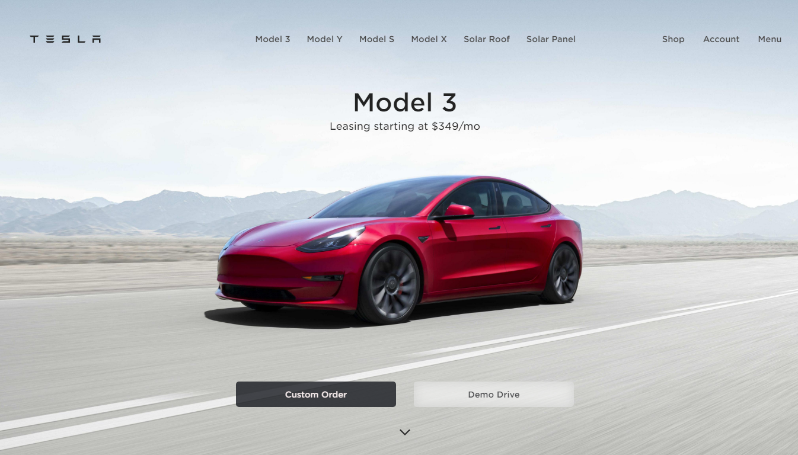
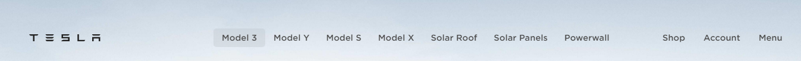
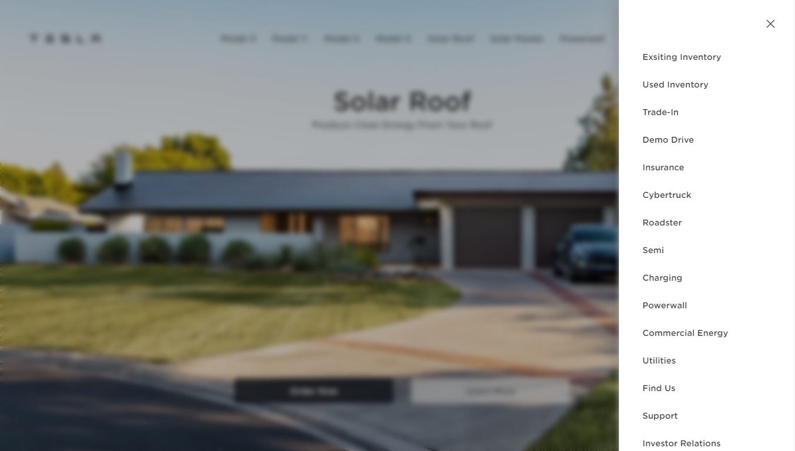
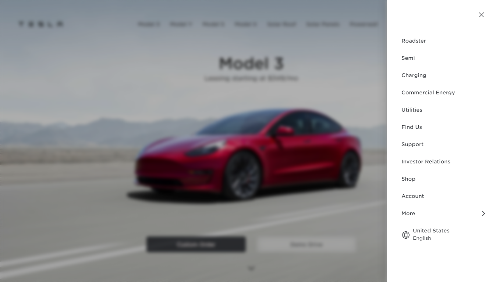
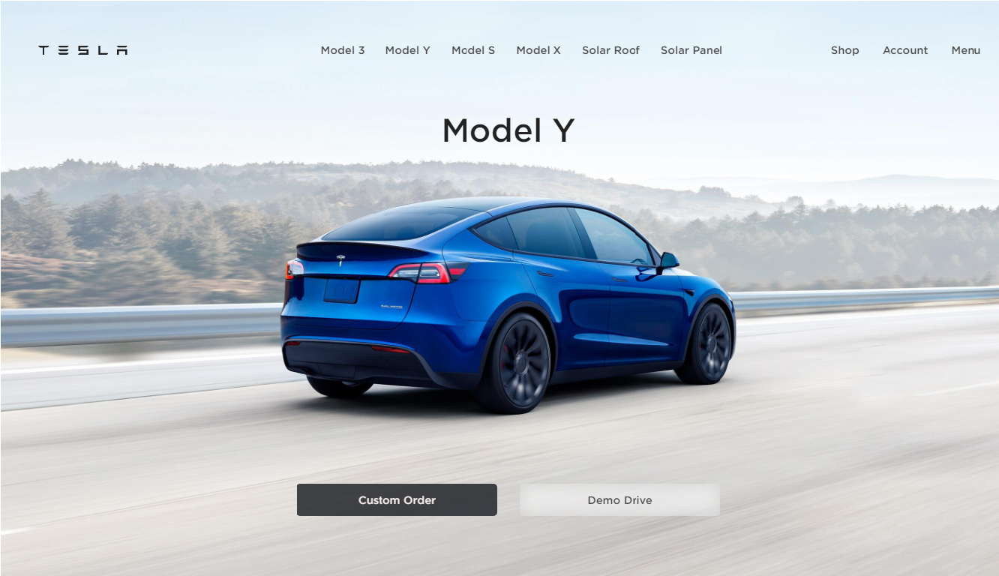
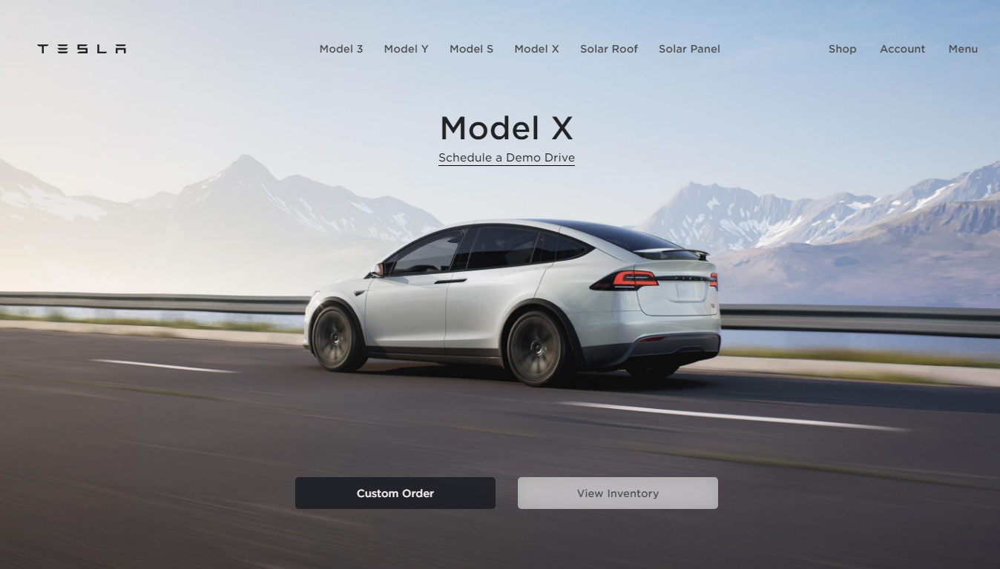
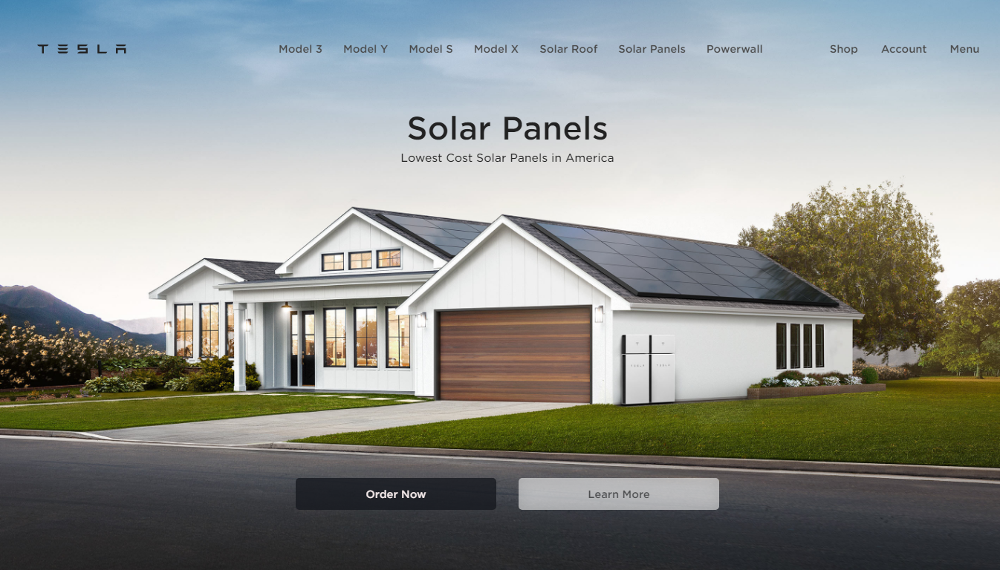

# Tesla Website Clone

This website is a website made based on the official Tesla website at www.tesla.com, where in this project, I will make the Tesla website as similar as possible to the original website and use all my skills in the field of Web Development.

In this project i learn a lot thing, besides i can refresh again my memory about HTML and CSS, i also learned my things about DOM usage and Event Handler in Javascript. Beside that, i also learned about Clean Code Implementation Javascript and new property from CSS, is called snap-scrolling. from this webiste also thought me the inportance of planning what i will do so that flow development will be clearly directed.

This is the first project website clone and this project will be continued to create other clone popular webiste. Maybe as I continue to learn and work, I will make a website that is neater and with a clear structure.

# Explanation Section
1. ## What tools i use to create this website?
   - ### whatFont
     To Getting what font type in the original website, i using extension name is whatFont. this extension will display what font type is using in a website. If you interesting with this extension you can [click this link](https://chrome.google.com/webstore/detail/whatfont/jabopobgcpjmedljpbcaablpmlmfcogm) to download the extension.

   - ### colorZilla
     To get the color of button, or something else, i using extension name is colorZilla. if you using this extension and hover it to elemen what you want to get the color, this extension will copy the color object based on what you hovering it. If you interesting with this extension you can [click this link](https://chrome.google.com/webstore/detail/colorzilla/bhlhnicpbhignbdhedgjhgdocnmhomnp) to download the extension

   - ### DevTools - Google Chrome (built-in web developer tools)
     To know more tool and feature on DevTools you can [click this link](https://developer.chrome.com/docs/devtools/).

     - #### Animation Tools
       i using tool from google devTools, the name is Animation Tools. This usefull tools for help you to knowing animation duration, animation delay, and animation timing function. and the working of this extension is by detecting animation on the website and chart will be appear displaying the element has been animated and information about animation from the element. this tools is very helpful for me to crate hover effect on navbar. to know how to using this tools you can  [click this link](https://developer.chrome.com/docs/devtools/css/animations/)

     - #### Workspace Project
       I to edit in realtime and can be saved at any time, I connect the directory of my project files with the devtools workspace so I don't have to go back and forth to edit the code in the code editor and can see the results in realtime. It's super usefull tool can save you a lot of time for coding dan give you faster time for getting right value. If you want to know more about this tool you can [click this link](https://developer.chrome.com/docs/devtools/workspaces/)

     - #### Device Mode
       By using this tools, we can easily create responsive web designs. Besides that, this tool also has a feature to display the media queries that we have created. To know more about this tool you can [click this link](https://developer.chrome.com/docs/devtools/device-mode/)

2. ## How I Create Scrolling Effect on My Clone Website
    For create effect that if we scrolling and that will stop in certain position, we can use property css called CSS Scroll Snap, to learn more about snap scrolling in CSS you can [click this link](https://developer.mozilla.org/en-US/docs/Web/CSS/scroll-snap-type)

    For create fade effect on text and button, we should get wrapper of all them that is main section, and we can use web API method called getBoundingClientRect() to get the x position of main section, create offset value you want (the greater the offset value, the longer the fade effect will be given) and calculate them with browser viewport to get opacity value that will be given every we scroll to main section. Besides that, you can use this effect for change title of every cars with same method like you get the opacity value. to know more about getBoundingClientRect() method you can [click this link](https://developer.mozilla.org/en-US/docs/Web/API/Element/getBoundingClientRect)

# Page Screenshoot

## 1. Navbar Section Screenshoot
Navbar With Hover Effect

## 2. Sidebar Section Screenshoot
### Sidebar Preview Top

### Sidebar Preview Bottom

## 3. Site Screenshoot
### Sidebar Image

### Screenshoot 1

### Screenshoot 2

### Screenshoot 3

### Screenshoot 4

### Screenshoot 5

### Screenshoot 6

### Screenshoot 7

## About Me
Muhammad Ghazy Humaidi, you can call me Ghazy, born and live in Bandung, Indonesia. I student of Darul Arqam Islamic Boarding School and now I in second grade of High school.

## My Social Media

## Contact Me
- 
- 
